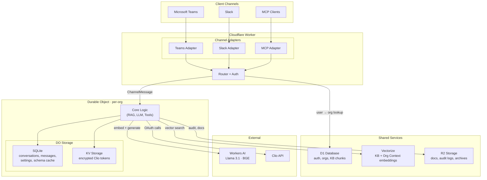

# Docket

An AI case management assistant for law firms and legal clinics using Clio. Users chat via Microsoft Teams, Slack, or MCP clients. The bot accesses a shared knowledge base, organization-specific context, and executes Clio operations.

**Status:** Phase 3 Complete — Starting Phase 4

## How It Works

```text
User → Chat Channel → Worker → Durable Object → AI + Clio → Response
```

The bot draws from three context sources:

- **Knowledge Base** — Shared case management best practices
- **Org Context** — Firm-specific procedures and documents
- **Clio Schema** — Cached API structure with custom fields

## Architecture



## Storage

- **D1** (shared) — Auth, org registry, KB chunks, subscriptions
- **Vectorize** (shared, filtered by org_id) — KB + Org Context embeddings
- **DO SQLite** (per-org) — Conversations, messages, settings, Clio schema
- **DO KV** (per-org) — Encrypted Clio OAuth tokens
- **R2** (per-org, path-isolated) — Org Context docs, audit logs, archives

## User Roles

- **Owner** — Full Clio access (with confirmation), full org management + ownership transfer
- **Admin** — Full Clio access (with confirmation), settings, Org Context, invites
- **Member** — Read-only Clio queries, no org management

## Development Phases

1. User interviews — validate plan with 3-4 people
2. Accounts & project init — Cloudflare, Clio sandbox, M365 dev tenant
3. Storage layer — D1 + Vectorize + R2
4. Auth foundation — Better Auth, channel linking, invitations
5. Knowledge Base — content + chunking + embeddings
6. Core Worker + DO — routing, adapters, permissions
7. Workers AI + RAG — LLM inference, vector retrieval
8. Clio integration — OAuth, token storage, schema caching
9. Website MVP — auth UI, org management, Org Context upload
10. Teams adapter — Bot Framework, manifest, sandbox testing
11. Production hardening, compliance, app store listing

## Documentation

Specs live in `/docs/00-specs`. Phase work artifacts in `/docs/01-10`.

- [00-overview](./docs/00-specs/00-overview.md) — Product overview
- [01-user-flows](./docs/00-specs/01-user-flows.md) — User journeys
- [02-technical-foundation](./docs/00-specs/02-technical-foundation.md) — Multi-tenant architecture
- [03-storage-schemas](./docs/00-specs/03-storage-schemas.md) — Database schemas
- [04-auth](./docs/00-specs/04-auth.md) — Authentication
- [05-channel-adapter](./docs/00-specs/05-channel-adapter.md) — Teams/Slack/MCP adapters
- [06-durable-objects](./docs/00-specs/06-durable-objects.md) — Per-org state management
- [07-knowledge-base](./docs/00-specs/07-knowledge-base.md) — RAG implementation
- [08-workers-ai](./docs/00-specs/08-workers-ai.md) — LLM integration
- [09-clio-integration](./docs/00-specs/09-clio-integration.md) — Clio API

## Tech Stack

Cloudflare Workers, Durable Objects (SQLite + KV), D1, Vectorize, R2, Workers AI (Llama 3.1 8B). Channels: Microsoft Teams, Slack, MCP.

## Local Development

```bash
# Install dependencies
npm install --legacy-peer-deps

# Reset local D1 database (wipes all data, re-runs migrations)
rm -rf .wrangler/state/v3/d1
npx wrangler d1 migrations apply docket-db --local

# Run tests
npm test

# Start local dev server
npx wrangler dev

# Apply migrations to production
npx wrangler d1 migrations apply docket-db --remote
```

## Contributing

`/docs/00-specs` is the source of truth. Omit needless code.
