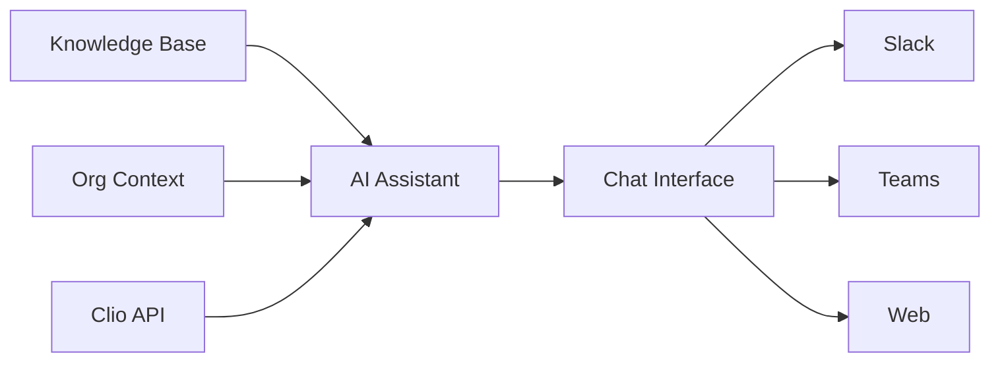
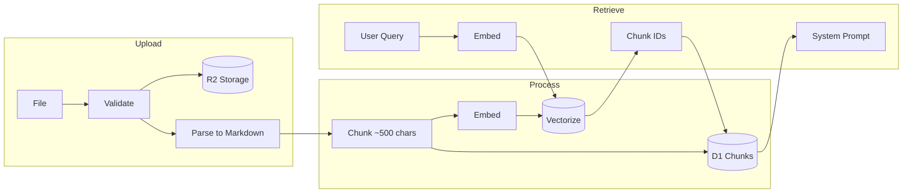
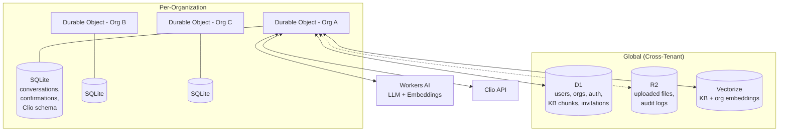

# Docket Diagrams

## #6: Three-Source Diagram

```mermaid
flowchart LR
    KB[Knowledge Base]
    ORG[Org Context]
    CRM[Clio API]

    KB --> AI
    ORG --> AI
    CRM --> AI

    AI[AI Assistant] --> CHAT[Chat Interface]

    CHAT --> SLACK[Slack]
    CHAT --> TEAMS[Teams]
    CHAT --> WEB[Web]
```

---

## #8: RAG + Upload Pipeline

```mermaid
flowchart LR
    subgraph Upload
        FILE[File] --> VALIDATE[Validate]
        VALIDATE --> R2[(R2 Storage)]
        VALIDATE --> PARSE[Parse to Markdown]
    end

    subgraph Process
        PARSE --> CHUNK[Chunk ~500 chars]
        CHUNK --> D1[(D1 Chunks)]
        CHUNK --> EMBED[Embed]
        EMBED --> VEC[(Vectorize)]
    end

    subgraph Retrieve
        QUERY[User Query] --> EMBED2[Embed]
        EMBED2 --> VEC
        VEC --> IDS[Chunk IDs]
        IDS --> D1
        D1 --> PROMPT[System Prompt]
    end
```

---

## #9: Storage Layer Diagram

```mermaid
flowchart TD
    subgraph Global["Global (Cross-Tenant)"]
        D1[(D1<br/>users, orgs, auth,<br/>KB chunks, invitations)]
        R2[(R2<br/>uploaded files,<br/>audit logs)]
        VEC[(Vectorize<br/>KB + org embeddings)]
    end

    subgraph PerOrg["Per-Organization"]
        DO1[Durable Object - Org A]
        DO2[Durable Object - Org B]
        DO3[Durable Object - Org C]

        DO1 --- SQL1[(SQLite<br/>conversations,<br/>confirmations,<br/>Clio schema)]
        DO2 --- SQL2[(SQLite)]
        DO3 --- SQL3[(SQLite)]
    end

    AI[Workers AI<br/>LLM + Embeddings]
    CLIO[Clio API]

    DO1 <--> D1
    DO1 <--> VEC
    DO1 <--> AI
    DO1 <--> CLIO
    DO1 <-.-> R2
```
