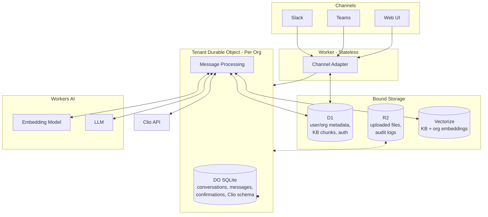

[docketadmin.com](https://docketadmin.com)

{{ #1: hero shot }}

I worked on Docket after a friend shared his organized knowledge base of operating procedures. He wanted a service that could pull from his knowledge base, access organizational context from clients, connect to their CRM, and work through Slack. He wanted to replace himself in his business and sell AI versions to clients.

We both read E-Myth Revisited by Michael Gerber about a year earlier. We had hypotheses on how Gerber's system of documenting yourself could apply in the AI age, and my friend had a strong knowledge base to work from.

## Hypothesis

An AI assistant could combine three sources: a knowledge base of industry content, organizational context like operating procedures, and live data from a CRM. The assistant would live in Slack where users already work.

This meant handling OAuth between the CRM and Slack, making conversation history readable by an LLM, and letting users upload documents for the LLM to reference.

{{ #6: three-source diagram }}

## Cloudflare Workers

I learned Cloudflare Workers through MCP work, which helped later for tool calls. Workers AI looked promising, and Durable Objects solved the coordination problem.

Durable Objects are isolated, single-threaded storage units with embedded SQLite. They bind to SQL, key-value storage, object storage, vector databases, and cron jobs. Durable Objects coordinate access to all databases and enforce sequential execution.

I designed the Worker to create a Durable Object for each organization. To handle messages from Slack, Teams, and the web UI, I created a channel adapter that normalizes messages before passing them to the Durable Object. Each new interface needs upfront work to build the normalizer, but once normalized, the Worker doesn't care where messages came from.

## Multitenant Architecture

The Worker routes messages from the channel adapter to the organization's Durable Object. Each organization has its own isolated Durable Object, so one firm's data never touches another's.

The Durable Object manages conversations, message history, custom field schemas, audit logs, and confirmation states in SQLite. Sequential execution matters because the LLM accesses all bound databases at once — without it, race conditions could corrupt state.

## Storage Architecture

Workers are stateless servers bound to Durable Objects and external services via bindings:

- D1 serves as global storae for user and org metadata, auth sessions, KB chunks, invitations, and subscriptions
- R2 stores uploaded files (parsed and embedded into D1), audit logs, and archives
- Vectorize indexes embeddings for the knowledge base and org context documents

Workers AI hosts the LLM and embedding model. The Durable Object SQLite holds conversations, messages, pending confirmations, and the custom Clio schema caches for each firm.

{{ #9: storage layer diagram }}

## The Pivot

My friend wanted to take it a different direction. That was fine — I continued to work on it but needed a new industry.

The first version (a Slack bot) proved that API calls and OAuth between Slack and the CRM worked, the conversation history was accessible, and the LLm could reference uploaded Org Context and the Knowledge Base. The architecture was validated, and I also discovered development pain points through this first build such as Users beign abel to upload Org Context that I had to prioritze on the rebuild.

{{ #5: slack fundraising assistant }}

## Why Lawyers

I needed an industry-specific CRM like Salesforce. I knew lawyers and adminsitrative assistants that woudl be available to interview, and Clio was a growing CRM that users liked. I also explored what the tool would look like for legal clinics, so I set up separate logins for clinics and firms.

{{ #10: clio dashboard }}

Talking to lawyers revealed that jurisdictions matter more than I expected. Different jurisdictions determine how to proceed through cases, which creates complexity for lawyers handling multiple states. This meant separate knowledge bases for different jurisdictions and practice types. I didn't need the knowledge base to be precise — that would require a legaltech cofounder. I just needed to test whether the LLM could distinguish between jurisdictions.

## Auth Architecture

I chose Better Auth because it's free and has native Cloudflare Workers + D1 support. It stores user accounts, passwords, and sessions in D1, so I own the data. For web, Better Auth handles session cookies. Slack and Teams needed different approaches.

For Teams, I used Microsoft's `OAuthCard` component from their bot framework. It generates an access token and user profile including email. The Worker receives this from the Bot Framework and adds the email to D1 for uninterrupted conversations.

Slack has no built-in SSO helper like Teams, so I used Better Auth magic links. If the Slack bot doesn't recognize a user, it sends them a URL. The magic link sends the user's Slack ID to the Worker, which stores it like the Teams email.

Adding a new channel requires upfront setup. After auth is configured, messages are normalized by the channel adapter before reaching the Worker.

## On Interfaces

The first version ran on Slack. It proved that Slack bots could execute API calls. Lawyers use Microsoft Teams more than Slack, so I built a Teams proof of concept: created the app, configured permissions, and connected Clio OAuth.

I pivoted to the web app. I needed a website anyway for account creation, org management, and document uploads. Teams was hard to test — users had to configure permissions in their tenant, and I couldn't see what was happening inside the bot framework.

The web made everything observable. I built a UI with conversation history, chat messages, and a process log showing which Knowledge Base and org context sources the LLM reads in real time.

{{ #2: process log panel }}

The web UI runs on Server-Sent Events (SSE). Message goes in, events stream back: content tokens as the LLM generates them, process updates for the sidebar, confirmation requests when the bot wants to write to Clio.

{{ #3: confirmation modal }}

Testing became easier. Instead of "configure Teams and tell me what it says," users could go to docketadmin.com, upload documents, and see how the chatbot thought and responded.

## The Knowledge Base

Two sources feed RAG: the shared Knowledge Base (jurisdiction and practice content I upload) and org-specific context (documents each firm uploads).

I built a tool to upload the Knowledge Base from markdown files. Folder paths determine metadata: files in `/kb/jurisdictions/CA/` get tagged `jurisdiction: "CA"`, files in `/kb/practice-types/family-law/` get `practice_type: "family-law"`. General content and federal jurisdiction always get included. When a California family law firm asks a question, Vectorize returns chunks from general, federal, California, and family law folders.

Vectorize doesn't support `OR` filters. If I want general `OR` federal `OR` California content, I can't write that as one query. So I run parallel Vectorize queries—one for each filter—then merge results by score and dedupe. An org with multiple jurisdictions and practice types might trigger 10+ parallel queries, but they're fast and the deduping handles overlap.

Content gets chunked at ~500 characters, stored in D1, then embedded and added to Vectorize. RAG locates relevant chunks through vector similarity, fetches full text from D1, and injects it into the system prompt. Token budget caps RAG context at ~3,000 tokens—lower-scored chunks get dropped if there's too much.

{{ #8: RAG + upload pipeline }}

My friend's documentation worked well with RAG because it was organized. For lawyers, I used sample textbooks I found online. I'm not a lawyer and Docket isn't meant to replace one — just administrative assistance. The textbook content didn't work as well, but it was good enough for trial.

## Org Context Uploads

Admin uploads a file through the web interface. The server validates it (MIME type, magic bytes, 25MB limit) and stores the raw file in R2 at `/orgs/{org_id}/docs/{file_id}`. Workers AI's `toMarkdown()` parses PDFs, DOCX, XLSX, and other formats into text. The text gets chunked, stored in D1's `org_context_chunks` table, embedded, and upserted to Vectorize with metadata `{ type: "org", org_id, source }`. The `type: "org"` filter keeps org context separate from the shared Knowledge Base. Deletes remove chunks from D1 and Vectorize, then delete the raw file from R2. Updates are delete-then-reupload.

{{ #4: org context upload }}

Retrieval works the same as the Knowledge Base: Worker receives message → search Vectorize → get IDs → fetch chunks from D1 → inject into prompt.

## Tool Calls

Tools matter for MCP compatibility. Beyond MCP, tools let AI interact with databases through strict commands with defined parameters.

The first version had 4 tools that executed specific commands. Each tool took significant work to build, and the payoff felt small. Worse, the AI struggled to decide which tool to use.

For Docket, I tried something different: an "API call knowledge base" that tools would use to build parameters dynamically. This failed. The LLM couldn't reliably construct proper tool calls on the fly. With conversation context and exact instructions competing for attention, it was too much for a single call.

Multiple dedicated tools is the right approach, but they have maintenance overhead. If the API changes, tools break. You'd need to poll API docs, auto-shutdown on mismatch, then manually fix each tool. Someone has to be available for that.

A better design would separate orchestration from execution. Let the LLM choose which tool to call (non-deterministic), but make the tool itself purely deterministic. Trying to consolidate everything cleverly backfired.

## Commanding Clio

The plan was everyone in an org could access the Knowledge Base and org context, plus run read operations in Clio ("what cases do I have next week"). Only admins could run write operations ("add a date to my calendar"). This could become a pricing tier later.

I needed safeguards for Docket to use Clio data. Users had to consent to create, read, and delete operations. They needed to understand what was being executed.

The bot confirms before making edits, like how Claude Code asks before editing code. Pending confirmations live in Durable Object state. The channel adapter works bidirectionally and responds fast — I built a fast path for confirmation responses.

## Agentic Developing

Most of this was developed with Claude using spec-driven development. Test-driven development helped too.

This was unfamiliar technology. Writing specs helped me understand the high-level architecture and recognize problems earlier. I focused on writing tests first and understanding what they needed to verify before implementing. Development moved faster because of that structure. Agentic coding tools are aluable for standing up quickly, I also recongized taking time to understand failures matters.

## Technical Flow

{{ #7: architecture overview }}

A user messages "What cases do I have next week" through Teams, Slack, or the web app. The message hits the channel adapter as JSON: channel ID, user metadata, timestamps. The adapter queries D1 for the user record, org metadata (industry, jurisdiction, ID), and role (admin or member). It sends a normalized message with user and org context to the Worker.

The Worker routes the message to the org's Durable Object. The Durable Object wakes from hibernation and stores the message in SQLite—this becomes conversation history the LLM can access. It generates an embedding of the message using Workers AI for RAG.

The embedding searches Vectorize twice in parallel: once for the shared Knowledge Base, once for org context documents. Vectorize returns chunk IDs of semantically similar content. The full text lives in D1.

D1 chunks, the user's message, and conversation history become parameters for the system prompt. The Clio schema from cache is attached so the LLM knows what objects exist in that org's Clio. Everything fits in one context window.

Workers AI runs the LLM. If the LLM calls the Clio API, we validate permissions. Reads execute immediately; writes require confirmation.

The response flows back through the Worker to the channel adapter, which reformats for the channel and sends it to the user.

Durable Objects make this happen in sequence with no race conditions. One message processes completely before the next. Every operation is logged.

## Retrospective

Giving an LLM unconstrained access to an API you don't control is dangerous. Talking to the bot felt like relearning Clio's commands with extra steps. Docket felt needless. Users had to describe things in specific ways to get results. They might as well learn Clio directly. Poor results with no one to blame.

This approach works better for APIs you control. Letting the LLM run against an external API — even with query constraints — is hard to make safe. Building those guardrails wasn't something I wanted to explore. RAG worked well. Cloudflare's file parsing worked well.

The second version's structure was too ambitious. I'm currently working on user feedback and opportunities to niche down as a legal clinic learning tool or focus on one practice type. The technical infastrucure has been validated: org context, Knowledge Base, and API calls combined. The scope needs to shrink.
